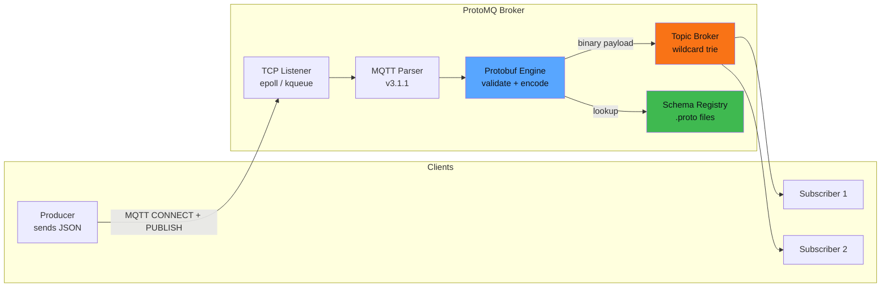

<h1 align="center">ProtoMQ</h1>

<p align="center">
  
  <br />
  <b>MQTT's simplicity. Protobuf's efficiency. Zig's bare-metal performance.</b>
  <br />
  Built for IoT and edge computing.
</p>

<p align="center">
  <a href="#quick-start">Quick Start</a> •
  <a href="#why-protomq">Why ProtoMQ</a> •
  <a href="#architecture">Architecture</a> •
  <a href="#performance">Performance</a> •
  <a href="FAQ.md">FAQ</a>
</p>

---

## What It Does

ProtoMQ is an MQTT broker that enforces **Protobuf schemas at the broker level**. Clients publish JSON; the broker validates, encodes to Protobuf, and routes compact binary payloads to subscribers. No code generation, no `.proto` compilation step on the client side.

<p align="center">
  
</p>

- **Schema-enforced messaging** — `.proto` files define the contract. Malformed payloads are rejected *before* they reach subscribers.
- **Custom Protobuf engine** — written from scratch in Zig. Runtime `.proto` parsing with zero external dependencies.
- **Wildcard topic routing** — full MQTT `+` and `#` wildcard support with O(1) matching via a trie-based topic broker.
- **Service Discovery** — clients query `$SYS/discovery/request` to discover available topics and download schemas automatically. No pre-shared `.proto` files needed.
- **Runs in 2.6 MB** — the entire broker with 100 active connections fits in under 3 MB of memory.

---

## Why ProtoMQ

Every IoT team eventually faces the same problem: JSON payloads are readable but *wasteful*. A 12-field sensor reading that takes 310 bytes in JSON compresses to 82 bytes in Protobuf — that's a **74% reduction** in bandwidth, which directly translates to lower radio usage, longer battery life, and cheaper data plans for cellular-connected devices.

<p align="center">
  
</p>

But switching to Protobuf introduces its own headache: you need code generation, language-specific stubs, and a way to keep producers and consumers in sync when schemas change. ProtoMQ removes that friction:

| Concern | Plain MQTT + JSON | ProtoMQ |
|---|---|---|
| Schema enforcement | None — anything goes | Validated at every `PUBLISH` |
| Payload format | JSON (~170 bytes for 8 fields) | Protobuf (~48 bytes) |
| Client bootstrap | Pre-shared docs, out-of-band | Built-in Service Discovery |
| Code generation | Required per language | Not needed — send JSON, receive Protobuf |
| Observability | Roll your own | Admin HTTP API included |

---

## Architecture



The broker is a single-threaded event loop built on `epoll` (Linux) or `kqueue` (macOS). There are no hidden allocations, no garbage collector, and no runtime — just Zig's `std.mem.Allocator` with explicit control over every byte.

The Protobuf engine parses `.proto` files at startup (or at runtime via the Admin API) and builds an in-memory schema registry. When a PUBLISH arrives, the engine validates the JSON payload against the registered schema, encodes it to Protobuf wire format, and hands the compact binary to the topic broker for fan-out.

---

## Quick Start

### Docker (recommended for trying it out)

```bash
docker compose up
```

The server starts on port `1883` with the schemas from the `schemas/` directory. Connect with any MQTT client.

### Build from source

Requires [Zig 0.15.2+](https://ziglang.org/download/).

```bash
git clone https://github.com/electricalgorithm/protomq.git
cd protomq

# Build and run the server
zig build run-server

# In another terminal — publish a JSON message
zig build run-client -- publish --topic sensors/temp \
  --json '{"device_id":"s-042","temperature":22.5,"humidity":61,"timestamp":1706140800}'

# In another terminal — subscribe to all sensor topics
zig build run-client -- subscribe --topic "sensors/#"
```

### Run tests

```bash
# Unit tests
zig build test

# Full integration suite
./tests/run_all.sh
```

---

## Performance

ProtoMQ handles **208,000 messages/second** on an Apple M2 Pro and **147,000 msg/s** on a Raspberry Pi 5 — with sub-millisecond p99 latency and no memory leaks across 100,000 connection cycles.

| Scenario | Apple M2 Pro | Raspberry Pi 5 |
|----------|--------------|----------------|
| **p99 latency** (100 clients) | 0.44 ms | 0.13 ms |
| **Throughput** (10-byte msgs) | 208k msg/s | 147k msg/s |
| **Throughput** (64 KB msgs) | 39k msg/s | 27k msg/s |
| **Sustained load** (10 min) | 8,981 msg/s | 9,012 msg/s |
| **Memory** (100 connections) | 2.6 MB | 2.5 MB |
| **Connection churn** (100k cycles) | 1,496 conn/s | 1,548 conn/s |
| **Memory leaks** | 0 MB | 0 MB |

All benchmarks run on loopback, `ReleaseSafe` mode, Zig 0.15.2. Methodology and raw JSON results: [`benchmarks/`](benchmarks/README.md).

---

## Service Discovery

Clients can discover topics and download the associated `.proto` schemas without any out-of-band configuration:

```bash
protomq-cli discover --proto-dir schemas
```

Under the hood, the client subscribes to `$SYS/discovery/request` and receives a `ServiceDiscoveryResponse` containing every registered topic-schema mapping including the full `.proto` source code. This lets new clients bootstrap themselves in a single round-trip.

---

## Admin Server

An optional HTTP server for runtime schema management and telemetry. Disabled by default — when the build flag is off, the code is stripped from the binary entirely (zero overhead, not just disabled).

```bash
# Enable at compile time
zig build -Dadmin_server=true run-server
```

| Endpoint | Description |
|---|---|
| `GET /metrics` | Active connections, message throughput, loaded schemas |
| `GET /api/v1/schemas` | Current topic-to-schema mappings |
| `POST /api/v1/schemas` | Register a new `.proto` schema and topic mapping at runtime |

All endpoints require `Authorization: Bearer <ADMIN_TOKEN>`. The Admin Server runs cooperatively on the same event loop — enabling it does not degrade MQTT performance.

| Build | Memory baseline | Admin API |
|---|---|---|
| `zig build` | ~2.6 MB | ✗ |
| `zig build -Dadmin_server=true` | ~4.0 MB | ✓ |

For detailed usage including dynamic schema registration: [FAQ](FAQ.md).

---

## Current Limitations

- QoS 0 only (at most once delivery)
- No persistent sessions
- No retained messages
- Single-node deployment

These are scope decisions for the initial release, not fundamental limitations. Multi-node and QoS 1/2 are on the roadmap.

---

## Contributing

Contributions are welcome! This project is under active development — if you're interested in MQTT internals, Protobuf wire format, or systems programming in Zig, there's plenty to work on.

## License

MIT — see [LICENSE](LICENSE).

## Resources

- [Zig Documentation](https://ziglang.org/documentation/master/)
- [MQTT v3.1.1 Specification](http://docs.oasis-open.org/mqtt/mqtt/v3.1.1/mqtt-v3.1.1.html)
- [Protocol Buffers](https://protobuf.dev/)
