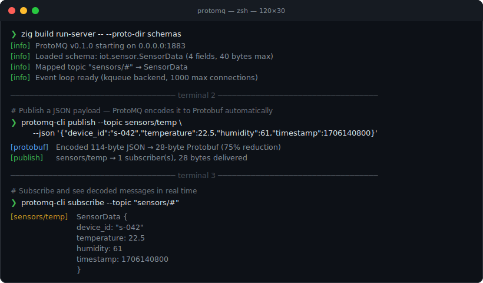
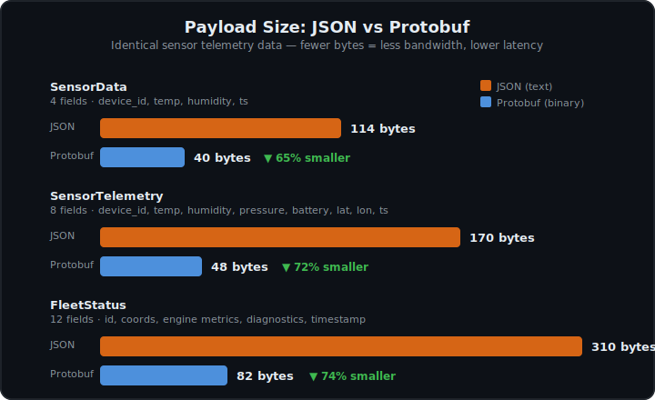

<h1 align="center">ProtoMQ</h1>

<p align="center">
  
  <br />
  <b>MQTT's simplicity. Protobuf's efficiency. Zig's bare-metal performance.</b>
  <br />
  Built for IoT and edge computing.
</p>

<p align="center">
  <a href="#quick-start">Quick Start</a> •
  <a href="#why-protomq">Why ProtoMQ</a> •
  <a href="#performance">Performance</a> •
  <a href="FEATURES.md">Features</a> •
  <a href="FAQ.md">FAQ</a>
</p>

---

ProtoMQ is an MQTT broker that enforces **Protobuf schemas at the broker level**. All messages on the wire are Protobuf — the broker validates incoming payloads against registered `.proto` schemas and rejects anything that doesn't conform. The bundled CLI can accept JSON and encode it to Protobuf client-side for convenience.

<p align="center">
  
</p>

- **Schema-enforced messaging** — `.proto` files define the contract. Malformed payloads get rejected *before* they reach subscribers.
- **Custom Protobuf engine** — written from scratch in Zig. Runtime `.proto` parsing, zero external dependencies.
- **Wildcard topic routing** — full MQTT `+` and `#` wildcard support via a trie-based topic broker.
- **Service Discovery** — clients query `$SYS/discovery/request` to discover topics and download schemas on the fly. No pre-shared `.proto` files needed.
- **Optional Admin HTTP API** — register new schemas and topic mappings at runtime, monitor connections and throughput. Disabled by default, zero overhead when off. See [FEATURES.md](FEATURES.md) for details.
- **Runs in 2.6 MB** — the entire broker with 100 active connections fits in under 3 MB of memory.

---

### Why ProtoMQ

If you've worked with IoT sensor fleets, you've probably been through this: you start with JSON over MQTT because it's easy to debug, every language has a parser, and `mosquitto_sub` lets you eyeball what's going on. It works fine... until you start caring about bandwidth.

A 12-field sensor reading weighs around 310 bytes in JSON. The same data in Protobuf: 82 bytes. On a cellular-connected device pushing telemetry every 5 seconds, that gap adds up to roughly 1.6 MB/day per device — multiply by a few thousand devices and the data bill starts hurting.

<p align="center">
  
</p>

But switching to Protobuf usually means code generation per language, keeping stubs in sync across firmware versions, and losing the ability to just read your payloads. ProtoMQ takes a different approach: the broker owns the `.proto` schemas and validates every message against them. The CLI can accept JSON and encode it to Protobuf before publishing, so you get a human-friendly workflow without sacrificing wire efficiency.

| | Plain MQTT + JSON | ProtoMQ |
|---|---|---|
| Schema enforcement | None — anything goes | Validated at every `PUBLISH` |
| Payload format | JSON (~170 bytes, 8 fields) | Protobuf (~48 bytes) |
| Client bootstrap | Pre-shared docs | Built-in Service Discovery |
| Code generation | Required per language | CLI encodes JSON → Protobuf for you |

---

### Under the Hood

ProtoMQ is not a wrapper around an existing broker — it's a ground-up implementation. Here's what makes it tick:

- **`epoll` / `kqueue` event loop** — single-threaded, no abstraction layer. The network layer talks directly to the OS kernel I/O primitives. On Linux that's `epoll`, on macOS `kqueue`. No libuv, no tokio, no hidden threads.
- **One allocator, full control** — every allocation goes through Zig's `std.mem.Allocator`. No GC, no hidden heap churn, no runtime. You can trace every byte the broker touches.
- **Zero third-party dependencies** — the MQTT parser, TCP connection handler, Protobuf wire format encoder, `.proto` file parser — all written in Zig using only the standard library. `build.zig.zon` has an empty `dependencies` block.
- **Runtime schema registry** — `.proto` files are parsed at startup and mapped to MQTT topics. With the Admin Server enabled, you can register new schemas and mappings at runtime over HTTP without restarting the broker.
- **Comptime-generated lookup tables** — the MQTT packet parser uses Zig's `comptime` to build dispatch tables at compile time. No branching, no hash maps — just array indexing.
- **Cross-compilation** — `zig build -Dtarget=aarch64-linux` produces a Raspberry Pi binary from a Mac. One command, no toolchain headaches.

---

### Quick Start

**Docker:**

```bash
docker compose up
```

The server starts on port `1883` with the schemas from `schemas/`. Connect with any MQTT client.

**From source** (requires [Zig 0.15.2+](https://ziglang.org/download/)):

```bash
git clone https://github.com/electricalgorithm/protomq.git
cd protomq
zig build run-server
```

```bash
# In another terminal — publish (CLI encodes JSON to Protobuf for you)
zig build run-client -- publish --topic sensors/temp \
  --json '{"device_id":"s-042","temperature":22.5,"humidity":61,"timestamp":1706140800}'

# In another terminal — subscribe
zig build run-client -- subscribe --topic "sensors/#"
```

---

### Performance

ProtoMQ handles **208,000 messages/second** on an Apple M2 Pro and **147,000 msg/s** on a Raspberry Pi 5 — with sub-millisecond p99 latency and no memory leaks across 100,000 connection cycles.

| Scenario | Apple M2 Pro | Raspberry Pi 5 |
|----------|--------------|----------------|
| **p99 latency** (100 clients) | 0.44 ms | 0.13 ms |
| **Throughput** (10-byte msgs) | 208k msg/s | 147k msg/s |
| **Throughput** (64 KB msgs) | 39k msg/s | 27k msg/s |
| **Sustained load** (10 min) | 8,981 msg/s | 9,012 msg/s |
| **Memory** (100 connections) | 2.6 MB | 2.5 MB |
| **Connection churn** (100k cycles) | 1,496 conn/s | 1,548 conn/s |
| **Memory leaks** | 0 MB | 0 MB |

All benchmarks run on loopback, `ReleaseSafe` mode, Zig 0.15.2. Methodology and raw results: [`benchmarks/`](benchmarks/README.md).

---

### Current Limitations

QoS 0 only (at most once delivery), no persistent sessions, no retained messages, single-node deployment. These are scope decisions for the initial release — multi-node and QoS 1/2 are on the roadmap.

### Contributing

Contributions are welcome. If you're interested in MQTT internals, Protobuf wire format, or systems programming in Zig, there's plenty to dig into. See [FEATURES.md](FEATURES.md) for the full feature set and [FAQ.md](FAQ.md) for deployment and configuration guides.
